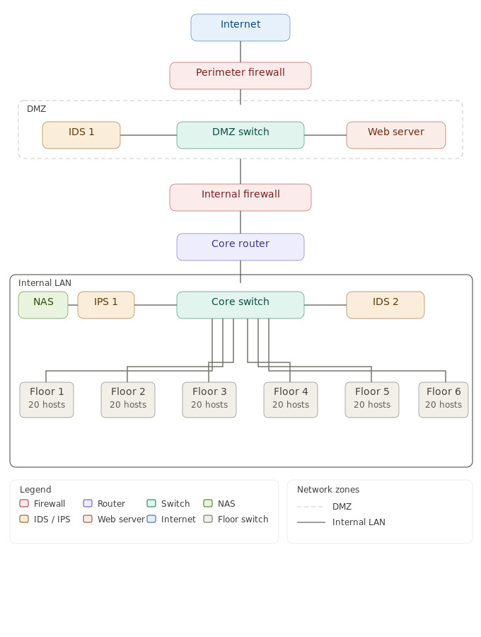

## Network Topology

Overview of the corporate network infrastructure, including 
DMZ segmentation, internal LAN, perimeter and internal 
firewalls, IDS/IPS placement, and floor-level switching.

### Design decisions

- **Dual firewall architecture**: perimeter firewall exposed 
  to internet, internal firewall separating DMZ from LAN
- **DMZ isolation**: web server and IDS 1 contained in a 
  dedicated demilitarized zone
- **Inline IPS**: IPS 1 positioned inline between core 
  switch and NAS for active traffic protection
- **IDS placement**: IDS 2 monitors traffic entering the 
  internal LAN from the core router
